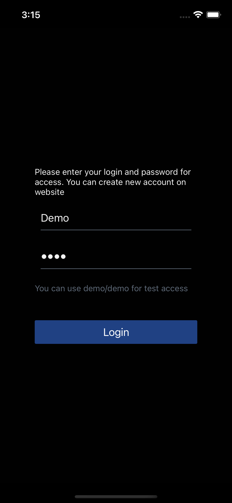
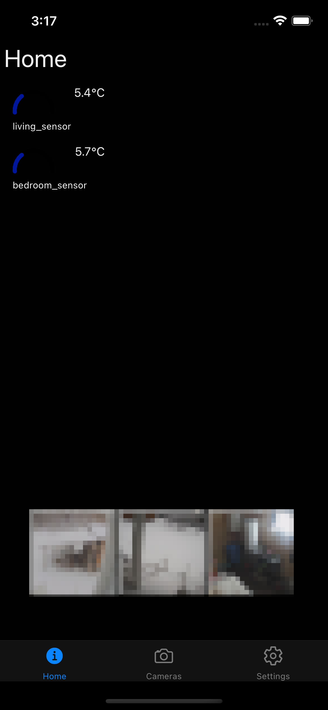
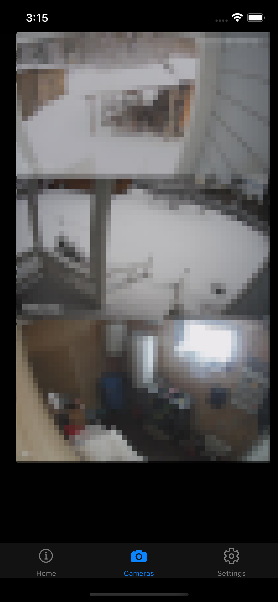
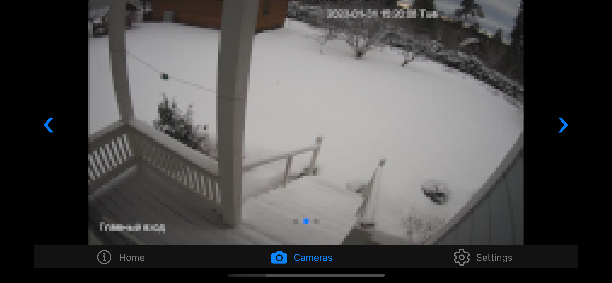

# AHomeApp
Simple home surveillance and monitoring application based on react-native

This application can provide basic monitoring of temperature sensors and stream
camera snapshots to mobile application

Application communicates with AHomeApp compatible server. 

# Used technologies / frameworks
    - React Native: cross platform mobile development based on React. Supported mobile platforms: IOS / Android 
    - Redux / Redux toolkit: application state management
    - RTK query: Redux based API integration
    - React Navigation: screen navigation
    - Typescript: typechecking / autocomplete
    - React Native Elements: Basic UI library

# Required environment
    - Node.JS 19.x
    - Java: 11
    - Yarn package manager

# How to run 
    - Setup development environment https://reactnative.dev/docs/environment-setup
    - yarn 
    - yarn ios or yarn android
    - deploy backend project 

# how to configure
    - create .env in root folder with following parameters
        API_URL = <backend api endpoint>
        example: API_URL = http://10.243.164.5:3000/

    

# How to debug
    - Install latest FB Flipper application. 
    - Or use Google chrome debugger. Application uses Hermes JS engine. https://reactnative.dev/docs/hermes 

# demo account
    - use demo/demo to use sample account

# example screenshots

